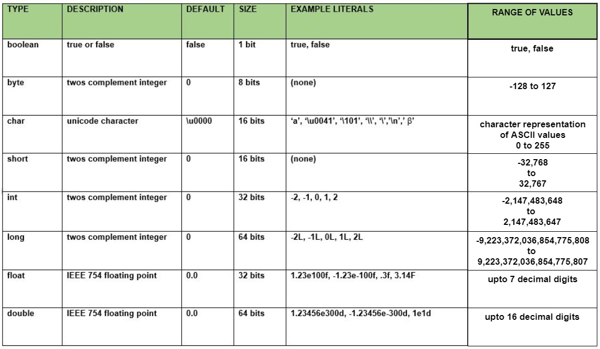
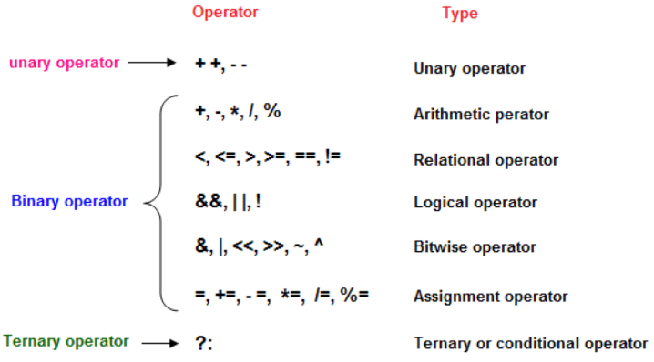
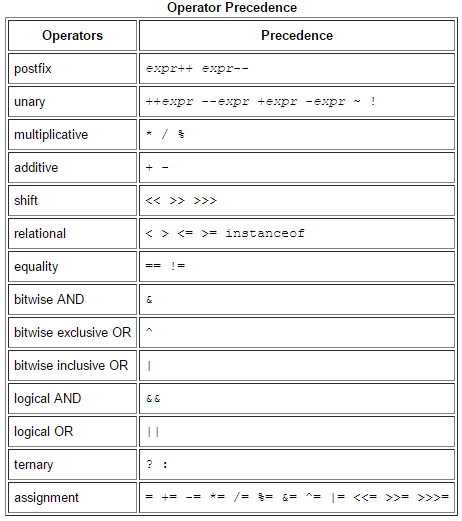
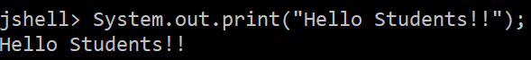
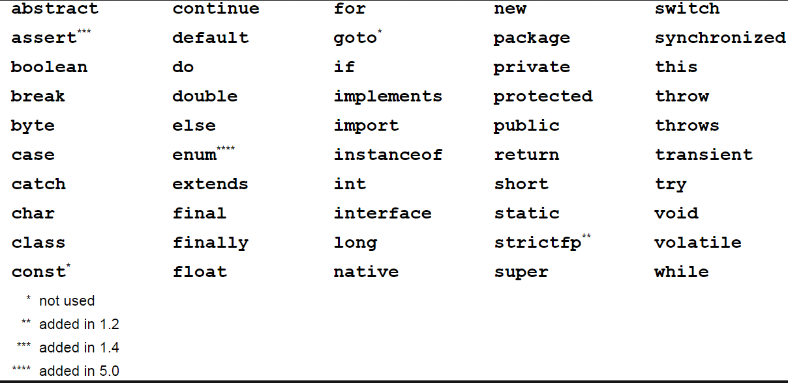
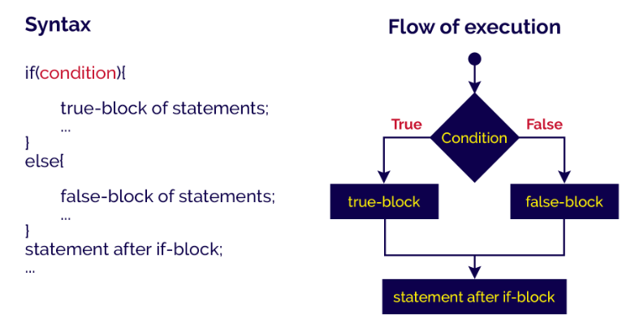
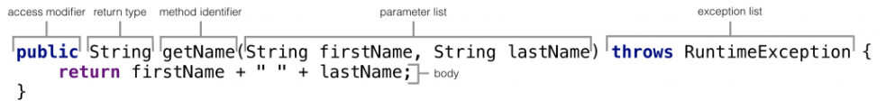

# Java Crash Course

> This is a Java Crash Course covering various Java topics, design patterns, performance tuning, interview problems
> and solutions and much more.

Tools used:

- JDK 11
- Maven
- JUnit 5, Mockito
- IntelliJ IDE

## Table of contents

### Module 1: Java Fundamentals Recap

1. Java Fundamentals
    - Data Types: Primitives, String
    - Operators
    - Statements, Expressions and Code Blocks
    - Methods
    - Control Flow (for, while loops)
3. Object-Oriented Programming
    - Classes, Objects, Interfaces, Abstract Classes
    - Inheritance - method overloading and overriding
    - Polymorphism - composition and encapsulation
4. Arrays and Collections
    - Arrays
    - Arrays class utility
    - List, Set, Map
    - Comparable and Comparator
    - Collections class utility
5. Concurrency Basics
    - Threading fundamentals - creation and coordination
    - Thread pools
    - Concurrent Collections
    - Synchronization techniques - Locks and Conditions
6. Lambda and Streams
    - Lambda Expressions
    - Functional Interfaces
    - Streams, Parallel Streams

---

### Module 2: Advanced Java Topics

---

### Module 3: Test-Driven Development and Test Automation

---

### Module 4: Clean Code, Refactoring, and Design Patterns

---

### Module 5: Message Queues and Event-Driven Architecture

---

### Module 6: Microservices and Distributed Systems

---

### Module 7: DevOps and CI/CD Pipeline

---

### Module 1: Java Fundamentals Recap

#### Chapter 01. Java Fundamentals

##### Data Types: Primitives, String



The 8 primitive data types supported by the Java programming language are:

`byte`: The byte data type is an 8-bit signed two's complement integer. It has a minimum value of -128 and a maximum
value of 127 (inclusive).

`short`: The short data type is a 16-bit signed two's complement integer. It has a minimum value of -32,768 and a
maximum value of 32,767 (inclusive).

`int`: By default, the int data type is a 32-bit signed two's complement integer, which has a minimum value of -2^31 and
a maximum value of 2^31-1. In Java SE 8 and later, we can use the int data type to represent an unsigned 32-bit integer,
which has a minimum value of 0 and a maximum value of 2^32-1.

`long`: The long data type is a 64-bit two's complement integer. The signed long has a minimum value of -2^63 and a
maximum value of 2^63-1. In Java SE 8 and later, we can use the long data type to represent an unsigned 64-bit long,
which has a minimum value of 0 and a maximum value of 2^64-1.

`float`: The float data type is a single-precision 32-bit IEEE 754 floating point. This data type should never be used
for precise values, such as currency. For that, we will need to use the `java.math.BigDecimal` class instead.

`double`: The double data type is a double-precision 64-bit IEEE 754 floating point. For decimal values, this data type
is generally the default choice. As mentioned above, this data type should never be used for precise values, such as
currency.

`boolean`: The boolean data type has only two possible values: `true` and `false`. Use this data type for simple flags
that track true/false conditions. This data type represents one bit of information, but its "size" isn't something that'
s precisely defined.

`char`: The char data type is a single 16-bit Unicode character. It has a minimum value of '\u0000' (or 0) and a maximum
value of '\uffff' (or 65,535 inclusive).

In addition to the eight primitive data types listed above, the Java programming language also provides special support
for character strings via the `java.lang.String` class. Enclosing character string within double quotes will
automatically create a new `String` object.

For example,

```
String s = "this is a string";
```

String objects are **immutable**, which means that once created, their values cannot be changed. The String class is not
technically a primitive data type, but considering the special support given to it by the language, we'll probably tend
to think of it as such.

###### Interview Problem 1 (UBS): Is there any limit to the length of String we can create in Java ?

**Solution**:

`String` in Java is defined by array of characters: `char[]`. An array can have `int` values as index.

Thus, we should be able to get a String of length whichever is **smaller**:

1. Integer.MAX_VALUE always 2,147,483,647 (231 - 1)
   (Defined by the Java specification, the maximum size of an array, which the String class uses for internal storage)

**OR**

2. Half of allotted maximum heap size (since each character is 2 bytes).

###### Interview Problem 2: Using Underscore Characters in Numeric Literals

In Java SE 7 and later, any number of underscore characters (_) can appear anywhere between digits in a numerical
literal. This feature enables, for example, to separate groups of digits in numeric literals, which can improve the
readability of our code.

For ex:

```
long creditCardNumber = 1234_5678_9012_3456L;
float pi = 3.14_15F;
byte nybbles = 0b0010_0101;
```

Which of the following are **valid** and **invalid** underscore placements in numeric literals:

```
float pi1 = 3_.1415F;

int x1 = 5_2;

float pi2 = 3._1415F;

long socialSecurityNumber1 = 999_99_9999_L;

int x2 = 52_;

int x3 = 5_______2;

int x5 = 0x_52;

int x6 = 0x5_2;
```

**Solution**:

```
float pi1 = 3_.1415F; // Invalid: cannot put underscores adjacent to a decimal point

int x1 = 5_2; // Valid

float pi2 = 3._1415F; // Invalid: cannot put underscores adjacent to a decimal point

long socialSecurityNumber1 = 999_99_9999_L; // Invalid: cannot put underscores prior to an L suffix

int x2 = 52_; // Invalid: cannot put underscores at the end of a literal

int x3 = 5_______2; // Valid

int x5 = 0x_52; // Invalid: cannot put underscores at the beginning of a number 

int x6 = 0x5_2; // Valid
```

##### Operators

Operators are special symbols that perform specific operations on one, two, or three operands, and then return a result.



They are classified based on the functionality they provide. Some types are:

- **Unary Operators**: Unary operators need only one operand. They are used to incrementing, decrement or negate a
  value.
    - Unary minus `–`, used for negating the values
    - Unary plus `+`, indicates the positive value (numbers are positive without this, however). It performs an
      automatic conversion to `int` when the type of its operand is the `byte`, `char`, or `short`. This is called unary
      numeric promotion.
    - Increment operator `++`, used for incrementing the value by 1. There are two varieties of increment operators:
        - Post-Increment: Value is first used for computing the result and then incremented
        - Pre-Increment: Value is incremented first, and then the result is computed
    - Decrement operator `--`, used for decrementing the value by 1. There are two varieties of decrement operators:
        - Post-decrement: Value is first used for computing the result and then decremented
        - Pre-Decrement: Value is decremented first, and then the result is computed
    - Logical **not** operator `!`, used for inverting a boolean value

- **Arithmetic Operators**: They are used to performing simple arithmetic operations on primitive data types.
    - Addition `+`
    - Subtraction `-`
    - Multiplication `*`
    - Division `/`
    - Modulo `%`

- **Relational Operators**: These operators are used to check for relations like equality, greater than, less than and
  return boolean results after the comparison.
    - Equal to `==`, returns true if the left-hand side is equal to the right-hand side.
    - Not Equal to `!=`, returns true if the left-hand side is not equal to the right-hand side.
    - Less than `<`, returns true if the left-hand side is less than the right-hand side.
    - Less than or equal to `<=`, returns true if the left-hand side is less than or equal to the right-hand side.
    - Greater than `>`, returns true if the left-hand side is greater than the right-hand side.
    - Greater than or equal to `>=`, returns true if the left-hand side is greater than or equal to the right-hand side.

- **Logical Operators**: These operators are used to perform “logical AND” and “logical OR” operations, i.e., a function
  similar to AND gate and OR gate in digital electronics. One thing to keep in mind is the second condition is not
  evaluated if the first one is false, i.e., it has a short-circuiting effect.
    - Logical AND `&&`, returns true when both conditions are true.
    - Logical OR `||`, returns true if at least one condition is true.
    - Logical NOT `!`, returns true when a condition is false and vice-versa

- **Bitwise Operators**: These operators are used to perform the manipulation of individual bits of a number.
    - Bitwise AND operator `&`, returns bit by bit AND of input values.
    - Bitwise OR operator `|`, returns bit by bit OR of input values.
    - Bitwise XOR operator `^`, returns bit-by-bit XOR of input values.
    - Bitwise Complement Operator `~`, This is a unary operator which returns the one’s complement representation of the
      input value, i.e., with all bits inverted.

- **Shift Operators**: These operators are used to shift the bits of a number left or right, thereby multiplying or
  dividing the number by two, respectively.
    - Left shift operator `<<`, shifts the bits of the number to the left and fills 0 on voids left as a result. Similar
      effect as multiplying the number with some power of two.
    - Signed Right shift operator `>>`, shifts the bits of the number to the right and fills 0 on voids left as a
      result. The leftmost bit depends on the sign of the initial number. Similar effect as dividing the number with
      some power of two.
    - Unsigned Right shift operator `>>>`, shifts the bits of the number to the right and fills 0 on voids left as a
      result. The leftmost bit is set to 0.

- **Assignment Operator**: This is used to assigning a value to any variable. It has a right to left associativity, i.e.
  value given on the right-hand side of the operator is assigned to the variable on the left, and therefore right-hand
  side value must be declared before using it or should be a constant. In many cases, the assignment operator can be
  combined with other operators to build a shorter version of the statement called a Compound Statement. This also helps
  to avoid any explicit casting. For example, instead of `a = a+5`, we can write `a += 5`.
    - Compound Addition `+=`, for adding left operand with right operand and then assigning it to the variable on the
      left.
    - Compound Subtraction `-=`, for subtracting right operand from left operand and then assigning it to the variable
      on the left.
    - Compound Multiplication `*=`, for multiplying left operand with right operand and then assigning it to the
      variable on the left.
    - Compound Division `/=`, for dividing left operand by right operand and then assigning it to the variable on the
      left.
    - Compound Modulo `%=`, for assigning modulo of left operand by right operand and then assigning it to the variable
      on the left.

- **Ternary Operator**: This is a shorthand version of the `if-else` statement. It has three operands and hence the name
  ternary. The general format is: `condition ? if true : if false`

- **`instanceof` Operator**: This is used for type checking. It can be used to test if an object is an instance of a
  class, a subclass, or an interface. The general format is: `object instanceof class/subclass/interface`

One of the most important things to consider is **operators precedence** used for evaluation of an expression.



Best practice is to use parenthesis `()` to change the precedence and make the code more readable.

###### Interview Problem 3 (CLSA): Compute the parity of a `long` word (64-bits).

The **parity** of a binary word (64-bit) is **1** if the number of 1s in the word is **odd**; otherwise, it is **0**.
For example, the parity of 1011 is 1, and the parity of 10001000 is 0. Parity checks are used to detect single bit
errors in data storage and communications.

**Solution**:

```
    // Time complexity: O(n) ~ n is 64-bit length, i.e. 64
    public static short parity(long word) {
        short result = 0;
        while (word != 0L) {
            result ^= (word & 1);
            word >>>= 1;
        }
        return result;
    }
```

Slightly optimised solution:

```
    // Time complexity: O(k) ~ k is no of set bits (1) in word
    public static short parityOptimised(long word) {
        short result = 0;
        while (word != 0L) {
            result ^= 1;
            word &= (word - 1); // drops the lowest set bit (1) of word
        }
        return result;
    }
```

##### Statements, Expressions and Code Blocks

###### What is a **statement** and an **expression** in Java?

In Java, a **statement** is an executable instruction that tells the compiler what to perform. It forms a complete
command to be executed and can include one or more **expressions**.

An **expression** is any valid unit of code that resolves to a value. Conceptually, there are two types of expressions:
those that assign a value to a variable and those that simply have a value.



For example:

```
// this whole line is a statement
System.out.print("Hello Students!!");

// this is an expression having a String value and it can be assigned to a variable
"Hello Students!!" 
``` 

###### Java Language Keywords

Here is a list of **keywords** in the Java programming language. We cannot use any of the following as identifiers in
our programs. The keywords `const` and `goto` are reserved, even though they are not currently used. `true`, `false`,
and `null` might seem like keywords, but they are actually literals; we cannot use them as identifiers in our programs.



###### Java Code Blocks

Writing code is similar to writing a document. It consists of special hierarchical units which together form a whole.

These are:

- **Expression**: An expression computes to a single value
- **Statement**: Statements are stand-alone units of work
- **Code Blocks**: A code block is a set of zero, one, or more statements, usually grouped together in some way to
  achieve a single goal

###### The if-then and if-then-else Statements

The `if-then` statement is the most basic of all the control flow statements. It tells our program to execute a certain
section of code only if a particular test evaluates to `true`.

The `if-then-else` statement provides a secondary path of execution when an "if" clause evaluates to `false`.



##### Methods

A method is a block of code which only runs when it is called. We can pass data, known as parameters, into a method.
Methods are used to perform certain actions, and they are also known as functions.

Why use methods?

To reuse code: define the code once, and use it many times.

A method consists of six parts:

- **Access modifier**: `public, protected, private, default (package-private) and static` => optionally we can specify
  from wherein the code one can access the method
- **Return type**: the type of the value returned by the method, if any => a method can return a primitive value or an
  object reference, or it can return nothing if we use the `void` keyword as the return type
- **Method identifier**: the name we give to the method
- **Parameter list**: an optional comma-separated list of inputs for the method => can have anywhere from 0 to 255
  parameters that are delimited by commas
- **Exception list**: an optional list of exceptions the method can throw
- **Body**: definition of the logic (can be empty)



