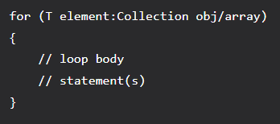
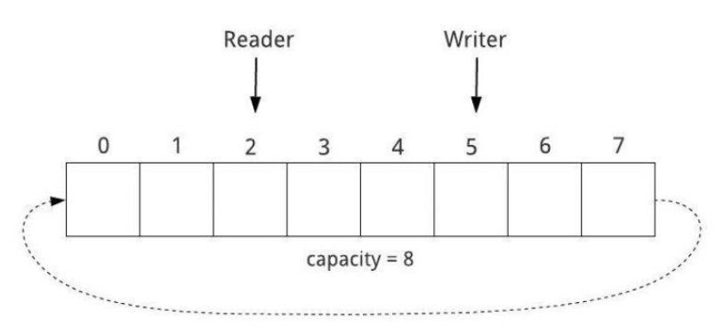
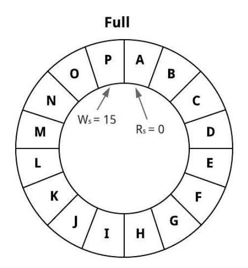
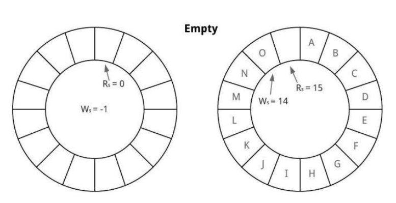
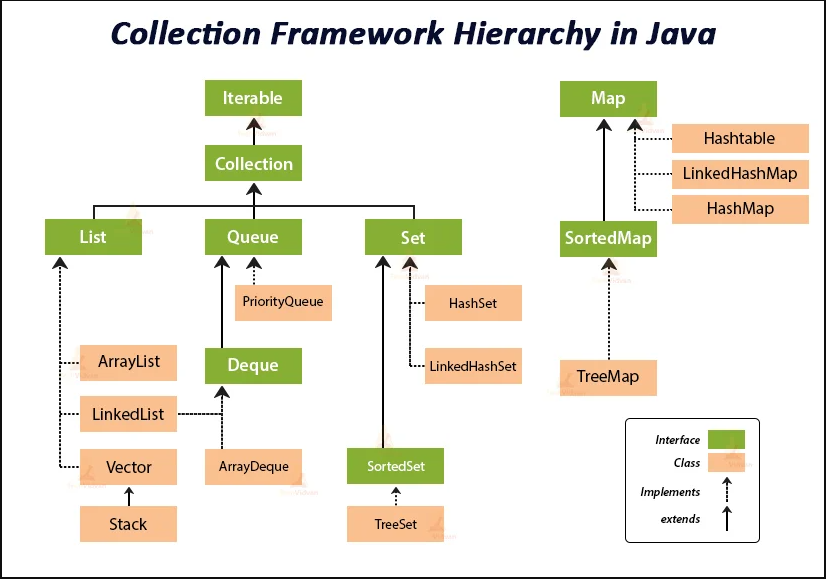
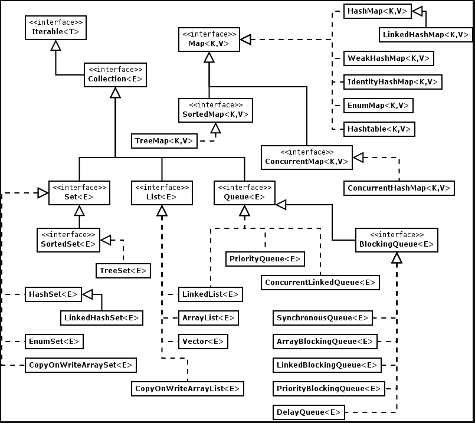
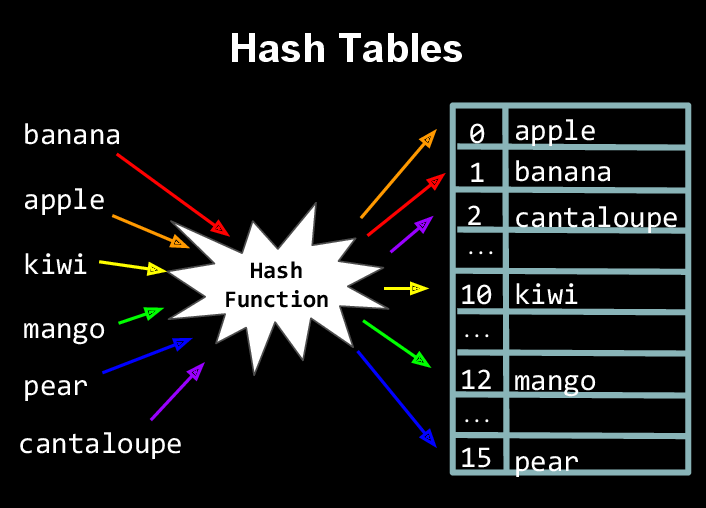
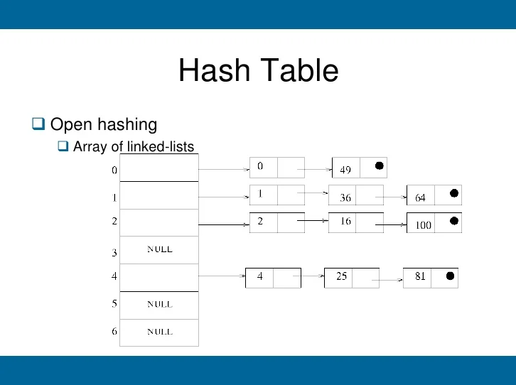

# Java Fundamentals Crash Course

> This is a Java fundamentals crash course covering basic Java topics, object-oriented programming, arrays and
> collections along with handful of real interview problems and solutions.

Tools used:

- JDK 11
- Maven
- JUnit 5, Mockito
- IntelliJ IDE

## Table of contents

1. [Java Fundamentals](https://github.com/backstreetbrogrammer/20_JavaCrashCourse#chapter-01-java-fundamentals)
    - [Data Types: Primitives, String](https://github.com/backstreetbrogrammer/20_JavaCrashCourse#data-types-primitives-string)
    - [Operators](https://github.com/backstreetbrogrammer/20_JavaCrashCourse#operators)
    - [Statements, Expressions and Code Blocks](https://github.com/backstreetbrogrammer/20_JavaCrashCourse#statements-expressions-and-code-blocks)
    - [Methods](https://github.com/backstreetbrogrammer/20_JavaCrashCourse#methods)
    - [Control Flow](https://github.com/backstreetbrogrammer/20_JavaCrashCourse#control-flow)
2. [Object-Oriented Programming](https://github.com/backstreetbrogrammer/20_JavaCrashCourse#chapter-02-object-oriented-programming)
    - [Classes and Objects](https://github.com/backstreetbrogrammer/20_JavaCrashCourse#classes-and-objects)
    - [Inheritance](https://github.com/backstreetbrogrammer/20_JavaCrashCourse#inheritance)
    - [Polymorphism - method overloading and overriding](https://github.com/backstreetbrogrammer/20_JavaCrashCourse#polymorphism-method-overloading-and-method-overriding)
3. [Arrays and Collections](https://github.com/backstreetbrogrammer/20_JavaCrashCourse#chapter-03-arrays-and-collections)
    - [Arrays](https://github.com/backstreetbrogrammer/20_JavaCrashCourse#arrays)
    - [Collections](https://github.com/backstreetbrogrammer/20_JavaCrashCourse#collections)

---

### Chapter 01. Java Fundamentals

#### Data Types: Primitives, String


The 8 primitive data types supported by the Java programming language are:

`byte`: The byte data type is an 8-bit signed two's complement integer. It has a minimum value of -128 and a maximum
value of 127 (inclusive).

`short`: The short data type is a 16-bit signed two's complement integer. It has a minimum value of -32,768 and a
maximum value of 32,767 (inclusive).

`int`: By default, the int data type is a 32-bit signed two's complement integer, which has a minimum value of -2^31 and
a maximum value of 2^31-1. In Java SE 8 and later, we can use the int data type to represent an unsigned 32-bit integer,
which has a minimum value of 0 and a maximum value of 2^32-1.

`long`: The long data type is a 64-bit two's complement integer. The signed long has a minimum value of -2^63 and a
maximum value of 2^63-1. In Java SE 8 and later, we can use the long data type to represent an unsigned 64-bit long,
which has a minimum value of 0 and a maximum value of 2^64-1.

`float`: The float data type is a single-precision 32-bit IEEE 754 floating point. This data type should never be used
for precise values, such as currency. For that, we will need to use the `java.math.BigDecimal` class instead.

`double`: The double data type is a double-precision 64-bit IEEE 754 floating point. For decimal values, this data type
is generally the default choice. As mentioned above, this data type should never be used for precise values, such as
currency.

`boolean`: The boolean data type has only two possible values: `true` and `false`. Use this data type for simple flags
that track true/false conditions. This data type represents one bit of information, but its "size" isn't something that'
s precisely defined.

`char`: The char data type is a single 16-bit Unicode character. It has a minimum value of '\u0000' (or 0) and a maximum
value of '\uffff' (or 65,535 inclusive).

In addition to the eight primitive data types listed above, the Java programming language also provides special support
for character strings via the `java.lang.String` class. Enclosing character string within double quotes will
automatically create a new `String` object.

For example,

```
String s = "this is a string";
```

String objects are **immutable**, which means that once created, their values cannot be changed. The String class is not
technically a primitive data type, but considering the special support given to it by the language, we'll probably tend
to think of it as such.

#### Interview Problem 1 (UBS): Is there any limit to the length of String we can create in Java ?

**Solution**:

`String` in Java is defined by array of characters: `char[]`. An array can have `int` values as index.

Thus, we should be able to get a String of length whichever is **smaller**:

1. Integer.MAX_VALUE always 2,147,483,647 (2^31 - 1)
   (Defined by the Java specification, the maximum size of an array, which the String class uses for internal storage)

**OR**

2. Half of allotted maximum heap size (since each character is 2 bytes).

- If heap size is **2 GB**, i.e. 2 * 1024 MB = 2 * 1024 * 1024 KB = 2 * 1024 * 1024 * 1024 Bytes.
- Dividing it by 2 gives = 1024 * 1024 * 1024 = **1,073,741,824**

Thus, the answer is that in JVM with heap size of **2 GB**, maximum length of String possible is **1,073,741,824**.

#### Operators

Operators are special symbols that perform specific operations on one, two, or three operands, and then return a result.


They are classified based on the functionality they provide. Some types are:

- **Unary Operators**: Unary operators need only one operand. They are used to incrementing, decrement or negate a
  value.
    - Unary minus `–`, used for negating the values
    - Unary plus `+`, indicates the positive value (numbers are positive without this, however). It performs an
      automatic conversion to `int` when the type of its operand is the `byte`, `char`, or `short`. This is called unary
      numeric promotion.
    - Increment operator `++`, used for incrementing the value by 1. There are two varieties of increment operators:
        - Post-Increment: Value is first used for computing the result and then incremented
        - Pre-Increment: Value is incremented first, and then the result is computed
    - Decrement operator `--`, used for decrementing the value by 1. There are two varieties of decrement operators:
        - Post-decrement: Value is first used for computing the result and then decremented
        - Pre-Decrement: Value is decremented first, and then the result is computed
    - Logical **not** operator `!`, used for inverting a boolean value

- **Arithmetic Operators**: They are used to performing simple arithmetic operations on primitive data types.
    - Addition `+`
    - Subtraction `-`
    - Multiplication `*`
    - Division `/`
    - Modulo `%`

- **Relational Operators**: These operators are used to check for relations like equality, greater than, less than and
  return boolean results after the comparison.
    - Equal to `==`, returns true if the left-hand side is equal to the right-hand side.
    - Not Equal to `!=`, returns true if the left-hand side is not equal to the right-hand side.
    - Less than `<`, returns true if the left-hand side is less than the right-hand side.
    - Less than or equal to `<=`, returns true if the left-hand side is less than or equal to the right-hand side.
    - Greater than `>`, returns true if the left-hand side is greater than the right-hand side.
    - Greater than or equal to `>=`, returns true if the left-hand side is greater than or equal to the right-hand side.

- **Logical Operators**: These operators are used to perform “logical AND” and “logical OR” operations, i.e., a function
  similar to AND gate and OR gate in digital electronics. One thing to keep in mind is the second condition is not
  evaluated if the first one is false, i.e., it has a short-circuiting effect.
    - Logical AND `&&`, returns true when both conditions are true.
    - Logical OR `||`, returns true if at least one condition is true.
    - Logical NOT `!`, returns true when a condition is false and vice-versa

- **Bitwise Operators**: These operators are used to perform the manipulation of individual bits of a number.
    - Bitwise AND operator `&`, returns bit by bit AND of input values.
    - Bitwise OR operator `|`, returns bit by bit OR of input values.
    - Bitwise XOR operator `^`, returns bit-by-bit XOR of input values.
    - Bitwise Complement Operator `~`, This is a unary operator which returns the one’s complement representation of the
      input value, i.e., with all bits inverted.

- **Shift Operators**: These operators are used to shift the bits of a number left or right, thereby multiplying or
  dividing the number by two, respectively.
    - Left shift operator `<<`, shifts the bits of the number to the left and fills 0 on voids left as a result. Similar
      effect as multiplying the number with some power of two.
    - Signed Right shift operator `>>`, shifts the bits of the number to the right and fills 0 on voids left as a
      result. The leftmost bit depends on the sign of the initial number. Similar effect as dividing the number with
      some power of two.
    - Unsigned Right shift operator `>>>`, shifts the bits of the number to the right and fills 0 on voids left as a
      result. The leftmost bit is set to 0.

- **Assignment Operator**: This is used to assigning a value to any variable. It has a right to left associativity, i.e.
  value given on the right-hand side of the operator is assigned to the variable on the left, and therefore right-hand
  side value must be declared before using it or should be a constant. In many cases, the assignment operator can be
  combined with other operators to build a shorter version of the statement called a Compound Statement. This also helps
  to avoid any explicit casting. For example, instead of `a = a+5`, we can write `a += 5`.
    - Compound Addition `+=`, for adding left operand with right operand and then assigning it to the variable on the
      left.
    - Compound Subtraction `-=`, for subtracting right operand from left operand and then assigning it to the variable
      on the left.
    - Compound Multiplication `*=`, for multiplying left operand with right operand and then assigning it to the
      variable on the left.
    - Compound Division `/=`, for dividing left operand by right operand and then assigning it to the variable on the
      left.
    - Compound Modulo `%=`, for assigning modulo of left operand by right operand and then assigning it to the variable
      on the left.

- **Ternary Operator**: This is a shorthand version of the `if-else` statement. It has three operands and hence the name
  ternary. The general format is: `condition ? if true : if false`

- **`instanceof` Operator**: This is used for type checking. It can be used to test if an object is an instance of a
  class, a subclass, or an interface. The general format is: `object instanceof class/subclass/interface`

One of the most important things to consider is **operators precedence** used for evaluation of an expression.


Best practice is to use parenthesis `()` to change the precedence and make the code more readable.

#### Interview Problem 2 (CLSA): Compute the parity of a `long` word (64-bits).

The **parity** of a binary word (64-bit) is **1** if the number of 1s in the word is **odd**; otherwise, it is **0**.
For example, the parity of number 11 (binary=1011) is 1, and the parity of number 136 (binary=10001000) is 0. Parity
checks are used to detect single bit errors in data storage and communications.

**Solution**:

```java
public class ComputeParity {

    public static short parityUsingApi(final long word) {
        final var bitCount = Long.bitCount(word);
        return (short) ((bitCount % 2 == 0) ? 0 : 1);
    }

    // Time complexity: O(n) ~ n is 64-bit length, i.e. 64
    public static short parity(long word) {
        short result = 0;
        while (word != 0L) {
            result ^= (word & 1);
            word >>>= 1;
        }
        return result;
    }

    // Time complexity: O(k) ~ k is no of set bits (1) in word
    public static short parityOptimised(long word) {
        short result = 0;
        while (word != 0L) {
            result ^= 1;
            word &= (word - 1); // drops the lowest set bit (1) of word
        }
        return result;
    }

}
```

**Unit Test**:

```java
import org.junit.jupiter.api.Test;

public class ComputeParityTest {

    @Test
    void testParity() {
        final var nums = new long[]{5L, -8L, 17L, 999L, 1L};
        for (final var num : nums) {
            System.out.printf("Num=[%d], Binary=[%s], BitCount=[%d], [parityUsingApi=%d], [parity=%d], [parityOptimised=%d]%n",
                              num,
                              Long.toBinaryString(num),
                              Long.bitCount(num),
                              ComputeParity.parityUsingApi(num),
                              ComputeParity.parity(num),
                              ComputeParity.parityOptimised(num));
        }
    }

}
```

**Output**:

```
Num=[5], Binary=[101], BitCount=[2], [parityUsingApi=0], [parity=0], [parityOptimised=0]
Num=[-8], Binary=[1111111111111111111111111111111111111111111111111111111111111000], BitCount=[61], [parityUsingApi=1], [parity=1], [parityOptimised=1]
Num=[17], Binary=[10001], BitCount=[2], [parityUsingApi=0], [parity=0], [parityOptimised=0]
Num=[999], Binary=[1111100111], BitCount=[8], [parityUsingApi=0], [parity=0], [parityOptimised=0]
Num=[1], Binary=[1], BitCount=[1], [parityUsingApi=1], [parity=1], [parityOptimised=1]
```

#### Statements, Expressions and Code Blocks

In Java, a **statement** is an executable instruction that tells the compiler what to perform. It forms a complete
command to be executed and can include one or more **expressions**.

An **expression** is any valid unit of code that resolves to a value. Conceptually, there are two types of expressions:
those that assign a value to a variable and those that simply have a value.


For example:

```
// this whole line is a statement
System.out.print("Hello Students!!");

// this is an expression having a String value and it can be assigned to a variable
"Hello Students!!" 
``` 

#### Java Language Keywords

Here is a list of **keywords** in the Java programming language. We cannot use any of the following as identifiers in
our programs. The keywords `const` and `goto` are reserved, even though they are not currently used. `true`, `false`,
and `null` might seem like keywords, but they are actually literals; we cannot use them as identifiers in our programs.


#### Java Code Blocks

Writing code is similar to writing a document. It consists of special hierarchical units which together form a whole.

These are:

- **Expression**: An expression computes to a single value
- **Statement**: Statements are stand-alone units of work
- **Code Blocks**: A code block is a set of zero, one, or more statements, usually grouped together in some way to
  achieve a single goal

**Local Variable**: available for use by the code block in which it is declared. It is also available to code blocks
that are contained by a declaring block.

**Scope**: describes the accessibility of a variable:

- "In scope" means the variable can be used in the code block
- "Out of scope" means the variable is no longer available in the code block

**Best practice**:

- declare and initialize variables in the same place if possible
- declare variables in the narrowest scope possible

#### The if-then and if-then-else Statements

The `if-then` statement is the most basic of all the control flow statements. It tells our program to execute a certain
section of code only if a particular test evaluates to `true`.

The `if-then-else` statement provides a secondary path of execution when an "if" clause evaluates to `false`.


#### Methods

A method is a block of code which only runs when it is called. We can pass data, known as parameters, into a method.
Methods are used to perform certain actions, and they are also known as functions.

**Parameter** is the definition as shown in the method declaration, and the **argument** is the value that is passed to
the method when we call it.

**Why use methods?**

To reuse code: define the code once, and use it many times.

A method consists of six parts:

- **Access modifier**: `public, protected, private, default (package-private) and static` => optionally we can specify
  from wherein the code one can access the method
- **Return type**: the type of the value returned by the method, if any => a method can return a primitive value or an
  object reference, or it can return nothing if we use the `void` keyword as the return type
- **Method identifier**: the name we give to the method
- **Parameter list**: an optional comma-separated list of inputs for the method => can have anywhere from 0 to 255
  parameters that are delimited by commas
- **Exception list**: an optional list of exceptions the method can throw
- **Body**: definition of the logic (can be empty)


#### Method Overloading

Method Overloading allows different methods to have the same name, but different signatures where the signature can
differ by the number of input parameters or type of input parameters, or a mixture of both.

Method overloading is also known as Compile-time Polymorphism, Static Polymorphism, or Early binding in Java.

Different Ways of Method Overloading in Java:

- Changing the Number of Parameters.
- Changing Data Types of the Arguments.
- Changing the Order of the Parameters of Methods

#### Exceptions and Errors

**Exception** is an unwanted or unexpected event, which occurs during the execution of a program, i.e. at run time, that
disrupts the normal flow of the program’s instructions. Exceptions can be caught and handled by the program. When an
exception occurs within a method, it creates an object. This object is called the exception object. It contains
information about the exception, such as the name and description of the exception and the state of the program when the
exception occurred.

There are 2 types of built-in Exceptions:

- **Checked Exceptions**: Checked exceptions are called compile-time exceptions because these exceptions are checked at
  compile-time by the compiler.
- **Unchecked Exceptions**: The unchecked exceptions are just opposite to the checked exceptions. The compiler will not
  check these exceptions at compile time. In simple words, if a program throws an unchecked exception, and even if we
  did not handle or declare it, the program would not give a compilation error.

**Errors** represent irrecoverable conditions such as Java virtual machine (JVM) running out of memory, memory leaks,
stack overflow errors, library incompatibility, infinite recursion, etc. Errors are usually beyond the control of the
programmer, and we should not try to handle errors.

Use **try-catch-finally** to handle Exceptions:


#### Control Flow

The statements inside our source files are generally executed from top to bottom, in the order that they appear. Control
flow statements, however, break up the flow of execution by employing decision-making statements (`if-then`,
`if-then-else`, `switch`), looping statements (`for`, `while`, `do-while`), and branching statements (`break`,
`continue`, `return`), enabling our program to conditionally execute particular blocks of code.

#### The `switch` statement

The `switch` statement is a multi-way branch statement. In simple words, the `switch` statement executes one statement
from multiple conditions. It is like an `if-else-if` ladder statement. It provides an easy way to dispatch execution to
different parts of code based on the value of the expression. It basically tests the equality of variables against
multiple values.


A `switch` works with the `byte`, `short`, `char`, and `int` primitive data types. It also works with enumerated types
(`Enum` Types), the `String` class, and Wrapper classes: `Character`, `Byte`, `Short`, and `Integer`.

Some important rules for `switch` statements:

- There can be any number of cases just imposing condition check but remember duplicate case/s values are not allowed.
- The value for a case must be of the same data type as the variable in the switch.
- The value for a case must be constant or literal. **Variables** are not allowed.
- The `break` statement is used inside the switch to terminate a statement sequence.
- The `break` statement is optional. If omitted, execution will continue on into the next case.
- The `default` statement is optional and can appear anywhere inside the switch block. In case, if it is not at the end,
  then a break statement must be kept after the default statement to omit the execution of the next case statement.

#### The `for` statement

Loops in Java come into use when we need to repeatedly execute a block of statements.

The `for` statement provides a compact way to iterate over a range of values. Programmers often refer to it as the "for
loop" because of the way in which it repeatedly loops until a particular condition is satisfied.

The general form of the `for` statement can be expressed as follows:


When using this version of the for statement, keep in mind that:

- The initialization expression initializes the loop; it's executed once, as the loop begins.
- When the termination expression evaluates to `false`, the loop terminates.
- The increment expression is invoked after each iteration through the loop; it is perfectly acceptable for this
  expression to increment or decrement a value.

The `for` statement also has another form designed for iteration through `Collections` and `arrays`. This form is
sometimes referred to as the `enhanced for statement`, and can be used to make our loops more compact and easy to read.

Syntax:



#### The `while` and `do-while` statements

The `while` statement continually executes a block of statements while a particular condition is `true`. Its syntax can
be expressed as:

```
while (expression) { 
    statement(s)
} 
```

The `while` statement evaluates expression, which must return a boolean value. If the expression evaluates to `true`,
the `while` statement executes the statement(s) in the `while` block. The `while` statement continues testing the
expression and executing its block until the expression evaluates to `false`.

The Java programming language also provides a `do-while` statement, which can be expressed as follows:

```
do { 
   statement(s)
} while (expression);
```

The difference between `do-while` and `while` is that `do-while` evaluates its expression at the bottom of the loop
instead of the top. Therefore, the statements within the `do block` are always executed **at least once**.

#### Interview Problem 3 (Merrill Lynch): Reverse Digits

Write a program which takes an integer and returns the integer corresponding to the digits of the input written in
reverse order.

For example, the reverse of **1234** is **4321**, and the reverse of **-975** is **-579**.

**Solution**:

```java
public class ReverseDigits {

    public static long reverseUsingApi(final int num) {
        final boolean isNegative = num < 0;
        final long remaining = Math.abs(num);
        final var builder = new StringBuilder(String.valueOf(remaining));
        builder.reverse();
        final var result = Long.parseLong(builder.toString());
        return isNegative ? -result : result;
    }

    public static long reverse(final int num) {
        final boolean isNegative = num < 0;
        long result = 0L;
        long remaining = Math.abs(num);
        while (remaining != 0) {
            result = (result * 10) + (remaining % 10);
            remaining /= 10;
        }

        return isNegative ? -result : result;
    }

}
```

**Unit Test**:

```java
import org.junit.jupiter.api.Test;

public class ReverseDigitsTest {

    @Test
    void testReverse() {
        final var nums = new int[]{1234, -975, 5436, 87580, -1};
        for (final var num : nums) {
            System.out.printf("Num=[%d], reverseUsingApi=[%d], reverse=[%d]%n",
                              num,
                              ReverseDigits.reverseUsingApi(num),
                              ReverseDigits.reverse(num));
        }
    }

}
```

**Output**:

```
Num=[1234], reverseUsingApi=[4321], reverse=[4321]
Num=[-975], reverseUsingApi=[-579], reverse=[-579]
Num=[5436], reverseUsingApi=[6345], reverse=[6345]
Num=[87580], reverseUsingApi=[8578], reverse=[8578]
Num=[-1], reverseUsingApi=[-1], reverse=[-1]
```

#### Interview Problem 4 (Goldman Sachs): Check if a decimal integer is palindrome

A palindromic String is one which reads the same forwards and backwards, e.g. civic, radar, level, rotor, kayak,
reviver, madam.

Write a program which determines if an integer is palindrome. For ex: 1, 6, 11, 121, 333, 2147412 should return `true`,
and, -1, 12, 100, 2147483647 should return `false`. (any negative number is never a palindrome)

**Solution**:

```java
public class IsPalindromeNumber {

    public static boolean isPalindromeNumber(int num) {
        if (num < 0) return false;
        else if (num == 0) return true;

        // no of digits in a number
        // ex: 1234 = log10(1234) + 1 => (int) 3.091 + 1 => 4
        final int numDigits = (int) (Math.floor(Math.log10(num))) + 1;

        // most significant digit = num / (10^numDigits-1)
        // ex: 1234 / 1000 => (int) 1.234 => 1
        int msdMask = (int) Math.pow(10, numDigits - 1);

        // least significant digit = num % 10
        // ex: 1234 % 10 => 4
        for (int i = 0; i < (numDigits / 2); ++i) {
            if ((num / msdMask) != (num % 10)) { // compare msd with lsd
                return false;
            }
            num %= msdMask; // remove the most significant digit of num
            num /= 10; // remove the least significant digit of num
            msdMask /= 100; // as 2 digits are removed
        }

        return true;
    }

}
```

**Unit Test**:

```java
import org.junit.jupiter.api.Test;

public class IsPalindromeNumberTest {

    @Test
    void testPalindromeNumber() {
        final var nums = new int[]{1, 6, 11, 121, 333, 2147412, -1, 12, 100, 2147483647};
        for (final var num : nums) {
            System.out.printf("Num=[%d], isPalindrome=[%b]%n", num, IsPalindromeNumber.isPalindromeNumber(num));
        }
    }

}
```

**Output**:

```
Num=[1], isPalindrome=[true]
Num=[6], isPalindrome=[true]
Num=[11], isPalindrome=[true]
Num=[121], isPalindrome=[true]
Num=[333], isPalindrome=[true]
Num=[2147412], isPalindrome=[true]
Num=[-1], isPalindrome=[false]
Num=[12], isPalindrome=[false]
Num=[100], isPalindrome=[false]
Num=[2147483647], isPalindrome=[false]
```

#### Interview Problem 5 (Merrill Lynch): Compute `x` to the power `y`

Write a program that takes double `x` and an integer `y` and returns `x` to the power `y` => `x.pow(y)`.

**Solution**:

```java
public class Power {

    public static double powerUsingApi(final double x, final int y) {
        return Math.pow(x, y);
    }

    public static double power(double x, final int y) {
        double result = 1D;
        long pow = y;

        // when y is negative => replace x by 1/x and y with -y
        if (y < 0) {
            pow = -pow;
            x = 1D / x;
        }

        // when y is a power of 2 => can replace (x^2)^2, ....
        // thus, if the LSB of y is 0 (even) => result is (x^(y/2))^2; otherwise it is (x * (x^(y/2))^2)
        while (pow != 0) {
            if ((pow & 1) != 0) { // LSB of y is not 0
                result *= x;
            }
            x *= x;
            pow >>>= 1; // right shift with 0, or it's equivalent to y/2
        }

        return result;
    }

}
```

**Unit Test**:

```java
import org.junit.jupiter.api.Test;

public class PowerTest {

    @Test
    void testPower() {
        final var nums = new double[]{2D, -3D, 1.1D};
        final var pows = new int[]{-3, 0, 1, 2, 3};
        for (final var x : nums) {
            for (final var y : pows) {
                System.out.printf("x=[%.2f], y=[%d], x.powerUsingApi(y)=[%.2f], x.power(y)=[%.2f]%n",
                                  x, y, Power.powerUsingApi(x, y), Power.power(x, y));
            }
            System.out.println();
        }
    }

}
```

**Output**:

```
x=[2.00], y=[-3], x.powerUsingApi(y)=[0.13], x.power(y)=[0.13]
x=[2.00], y=[0], x.powerUsingApi(y)=[1.00], x.power(y)=[1.00]
x=[2.00], y=[1], x.powerUsingApi(y)=[2.00], x.power(y)=[2.00]
x=[2.00], y=[2], x.powerUsingApi(y)=[4.00], x.power(y)=[4.00]
x=[2.00], y=[3], x.powerUsingApi(y)=[8.00], x.power(y)=[8.00]

x=[-3.00], y=[-3], x.powerUsingApi(y)=[-0.04], x.power(y)=[-0.04]
x=[-3.00], y=[0], x.powerUsingApi(y)=[1.00], x.power(y)=[1.00]
x=[-3.00], y=[1], x.powerUsingApi(y)=[-3.00], x.power(y)=[-3.00]
x=[-3.00], y=[2], x.powerUsingApi(y)=[9.00], x.power(y)=[9.00]
x=[-3.00], y=[3], x.powerUsingApi(y)=[-27.00], x.power(y)=[-27.00]

x=[1.10], y=[-3], x.powerUsingApi(y)=[0.75], x.power(y)=[0.75]
x=[1.10], y=[0], x.powerUsingApi(y)=[1.00], x.power(y)=[1.00]
x=[1.10], y=[1], x.powerUsingApi(y)=[1.10], x.power(y)=[1.10]
x=[1.10], y=[2], x.powerUsingApi(y)=[1.21], x.power(y)=[1.21]
x=[1.10], y=[3], x.powerUsingApi(y)=[1.33], x.power(y)=[1.33]
```

---

#### Chapter 02. Object-Oriented Programming

**Object-Oriented Programming (OOP)** is a programming paradigm in computer science that relies on the concept of
classes and objects. It is used to structure a software program into simple, reusable pieces of code blueprints (usually
called classes), which are used to create individual instances of objects.


Building blocks of OOP:

- **Class**: A class is a blueprint or prototype from which objects are created. In a nutshell, classes are essentially
  user-defined data types. Classes are where we create a blueprint for the structure of methods and attributes.
  Individual objects are instantiated from this blueprint. Classes contain fields for attributes and methods for
  behaviors.
- **Object**: Objects are instances of a class created with specific data. An object is a software bundle of related
  state and behavior. Software objects are often used to model the real-world objects that we find in everyday life.
- **Attributes**: Attributes are the information that is stored. Attributes are defined in the `Class` template. When
  objects are instantiated, individual objects contain data stored in the Attributes field. The state of an object is
  defined by the data in the object’s attributes fields.
- **Methods**: Methods represent behaviors. Methods perform actions; methods might return information about an object or
  update an object’s data. The method’s code is defined in the class definition. When individual objects are
  instantiated, these objects can call the methods defined in the class.

The four pillars of object-oriented programming are:

- **Inheritance**: child classes inherit data and behaviors from the parent class
- **Encapsulation**: containing information in an object, exposing only selected information
- **Abstraction**: only exposing high-level public methods for accessing an object
- **Polymorphism**: designing objects to share behaviors. Using inheritance, objects can override shared parent
  behaviors with specific child behaviors. Polymorphism allows the same method to execute different behaviors in two
  ways: method overriding and method overloading.

Benefits of OOP for software engineering:

- OOP models complex things as reproducible, simple structures
- Reusable, OOP objects can be used across programs
- Polymorphism allows for class-specific behavior
- Easier to debug, classes often contain all applicable information to them
- Securely protects sensitive information through encapsulation

#### Classes and Objects

A class in java can contain:

- data member
- constructor
- method
- nested class
- interface

A class example:


**Static** variables vs **Instance** variables:

- Instance variables (non-static fields) are unique to each instance of a class.
- Class variables (static fields) are fields declared with the `static` modifier; there is exactly one copy of a class
  variable, regardless of how many times the class has been instantiated.
- To access the instance variable, we MUST create a new instance of the class. Static variables are accessible through
  class reference, and do not require creating an object instance.

In the context of class attributes, `static` has a different meaning. If we have a field like:

```
private static int sharedAttribute;
```

then, each and every instance of the class will share the same variable, so that if we change it in one instance, the
change will reflect in all instances, created either before or after the change.

There are cases where this behaviour is absolutely desirable:

- Class constants: since they are constants, having all the classes access the same value will do no harm, because no
  one can change that. They can save memory too, if we have a lot of instances of that class.
- Variables that are intended to be shared, such as reference counters.

Static variables are instantiated before our program starts and a static **method** can only access **static**
attributes.

**Static** methods vs **Instance** methods:

Instance method are methods which require an object of its class to be created before it can be called. To invoke a
instance method, we have to create an Object of the class in which the method is defined.

Instance methods are stored in **heap** but the parameters (arguments passed to them) and their local variables and the
value to be returned are allocated in **stack**. They can be called within the same class in which they reside or from
the different classes defined either in the same package or other packages depending on the **access type** provided to
the desired instance method.

Instance methods can be **overridden** since they are resolved using **dynamic binding** at run time.

Static methods are the methods that can be called **without** creating an object of class. They are referenced by the
class name itself or reference to the Object of that class.

Static methods are stored in heap as they are associated with the **class** in which they reside and not to the objects
of that class. But their local variables and the passed argument(s) to them are stored in the **stack**.

Static methods can **not** be **overridden**, since they are resolved using **static binding** by the compiler at
compile time. However, we can have the same name methods declared `static` in both **superclass** and **subclass**, but
it will be called **Method Hiding** as the derived class method will hide the base class method.

#### Interview Problem 6 (JP Morgan Chase): Design an immutable class in Java

Immutability is a characteristic of Java objects that makes them immutable to future changes once they have been
initialized. Its internal state cannot be changed in any way.

JDK itself has lots of immutable classes. Given is such a list of immutable classes in Java.

- `java.lang.String`
- Wrapper classes such as `Integer`, `Long`, `Double` etc
- `java.math.BigInteger` and `java.math.BigDecimal`
- Unmodifiable collections such as `Collections.singletonMap()`
- `java.lang.StackTraceElement`
- Java **enums**
- `java.util.Locale`
- `java.util.UUID`
- Java 8 Date Time API – `LocalDate`, `LocalTime` etc.

Design an immutable class in Java with an example.

**Solution**:

To create an immutable class in Java, we need to follow these general principles:

- Do not allow subclasses to override methods. The easiest way is to declare the class as `final`. Final classes in Java
  can not be extended.
- Make all fields `final` and `private`. Fields declared `private` will not be accessible outside the class, and making
  them `final` will ensure that we can not change them even accidentally.
- Initialize all fields using a **constructor** method performing **deep copy**.
- Do not provide **setter** methods. Setter methods are meant to change an object’s state, which we want to prevent
  here.
- Special attention to “immutable classes with mutable fields“. Always remember that member fields will be either
  mutable or immutable. Values of immutable members (`primitives`, `wrapper classes`, `String` etc.) can be returned
  safely from the getter methods. For mutable members (`POJO`, `collections` etc.), we must copy the content into a new
  `Object` before returning from the **getter** method.

```java
import java.util.List;
import java.util.Map;

public final class ImmutableClass {

    private final long id;
    private final String name;
    private final List<String> tokens;
    private final Map<String, String> metadata;

    public ImmutableClass(final long id, final String name, final List<String> tokens,
                          final Map<String, String> metadata) {
        this.id = id;
        this.name = name;

        // deep copy
        this.tokens = List.copyOf(tokens);
        this.metadata = Map.copyOf(metadata);
    }

    public long getId() {
        return id;
    }

    public String getName() {
        return name;
    }

    public List<String> getTokens() {
        // clone
        return List.copyOf(tokens);
    }

    public Map<String, String> getMetadata() {
        // clone
        return Map.copyOf(metadata);
    }

    @Override
    public String toString() {
        return "ImmutableClass{" +
                "id=" + id +
                ", name='" + name + '\'' +
                ", tokens=" + tokens +
                ", metadata=" + metadata +
                '}';
    }

}
```

**Unit Test**:

```java
import org.junit.jupiter.api.Test;

import java.util.ArrayList;
import java.util.HashMap;
import java.util.List;
import java.util.Map;

public class ImmutableClassTest {

    @Test
    void testImmutableClass() {
        final List<String> list = new ArrayList<>();
        list.add("tok1");
        list.add("tok2");

        final Map<String, String> map = new HashMap<>();
        map.put("1", "first");
        map.put("2", "second");

        final ImmutableClass obj = new ImmutableClass(101L, "ABC", list, map);
        System.out.println(obj);

        list.add("tok3");
        list.add("tok4");
        // Remains unchanged due to deep copy in constructor
        System.out.println(obj.getTokens());

        map.put("3", "third");
        map.put("4", "fourth");
        // Remains unchanged due to deep copy in constructor
        System.out.println(obj.getMetadata());
    }

}
```

**Output**:

```
ImmutableClass{id=101, name='ABC', tokens=[tok1, tok2], metadata={1=first, 2=second}}
[tok1, tok2]
{1=first, 2=second}
```

**Objects** are instances of a class created with specific data. An object consists of :

- **State**: It is represented by attributes of an object. It also reflects the properties of an object.
- **Behavior**: It is represented by the methods of an object. It also reflects the response of an object with other
  objects.
- **Identity**: It gives a unique name to an object and enables one object to interact with other objects.

**Constructor** is a special method that is used to initialize objects. The constructor is called when an object of a
class is created. It can be used to set initial values for object attributes.

At the time of calling the constructor, memory for the object is allocated in the memory. Every time an object is
created using the `new` keyword, at least one constructor is called.

It is not necessary to write a constructor for a class. It is because java compiler creates a default constructor
(constructor with no-arguments) if our class does not have any.

The first line of a constructor is a call to `super()` or `this()`, (a call to a constructor of a super-class or an
overloaded constructor), if we don’t type in the call to `super()` in our constructor, the compiler will provide with a
non-argument call to `super()` at the first line of our code.

When an object is constructed using `new` (as opposed to being `deserialized`), following things happen in this
sequence:

1. All instance variables are assigned default values - like `int` as **0**, `double` as **0D**, `boolean` as **false**
   , `String` as **null**, etc.

2. The constructor is invoked, which immediately invokes the superclass constructor `super()` OR another overloaded
   constructor `this()`, until one of the overloaded constructors invokes the superclass constructor.

3. All superclass constructors complete.

4. Instance variables that are initialized as part of their declaration are assigned their initial value overriding the
   default values they’re given prior to the superclass constructors completing.

5. The constructor completes.

#### Interview Problem 7 (Barclays): How many ways to create an object of a class?

When an object of a class is created, the class is said to be **instantiated**. All the instances share the attributes
and the behavior of the class. But the values of those attributes, i.e. the state are unique for each object. A single
class may have any number of instances or objects.

How many ways are there to create an object of a class?

**Solution**:

There are 4 ways to create objects in Java. Strictly speaking there is only one way (by using `new` keyword), and the
rest internally use `new` keyword.

1. Using `new` keyword

```
MyObject object = new MyObject();
```

2. Using `Class.forName()`: only if the class has a public default constructor, we can create an object in this way.

```
MyObject object = (MyObject) Class.forName("com.backstreetbrogrammer.MyObject").newInstance();
```

3. Using `clone()`: only classes that implement the interface `Cloneable` can be cloned.

```
MyObject anotherObject = new MyObject(); 
MyObject object = anotherObject.clone();
```

4. Using Object **deserialization**: creating an object from its **serialized** form.

```
ObjectInputStream inStream = new ObjectInputStream(anInputStream ); 
MyObject object = (MyObject) inStream.readObject();
```

#### Inheritance

One of the core principles of Object-Oriented Programming – inheritance – enables us to reuse existing code or extend an
existing type.

Simply put, a `class` can inherit another `class` and multiple `interfaces`, while an `interface` can inherit other
`interfaces`.

A child class inherits from parent class using `extends` keyword and use the keyword `implements` to inherit an
interface.

Classes in Java support **single** inheritance; the child class can't extend multiple classes. In the absence of
an `extends` keyword, a class implicitly inherits class `java.lang.Object`.

A subclass class inherits the **non-static** `protected` and `public` members from the superclass class. In addition,
the members with **default** (`package-private`) access are inherited if the two classes are in the **same** package.

On the other hand, the `private` and `static` members of a class are **not** inherited.

#### Class Inheritance

A class can inherit another class and define additional members.

Base class `Animal`:

```java
public class Animal {
    String type;
    String size;
    double weight;

    void move(final String speed) {
        // describe the speed or movement
    }
}
```

The class `Dog` can inherit the members of `Animal` class by using the keyword `extends` in its declaration:

```java
public class Dog extends Animal {
    String tailShape;

    // unique to Dog
    void bark() {
        System.out.printf("This dog of size=[%s] and weight=[%f] barks very loudly%n", size, weight);
    }
}
```

To access inherited properties or methods, we can simply use them directly, and we don't need a reference to the
superclass to access its members.

#### Interface Inheritance

Although classes can inherit only **one** `class`, they can implement **multiple** `interfaces`.

```java
public interface Floatable {
    void floatOnWater();
}
```

```java
public interface Flyable {
    void fly();
}
```

```java
public class Dog extends Animal implements Floatable, Flyable {
    public void floatOnWater() {
        System.out.println("I can swim but can not float like a duck!");
    }

    public void fly() {
        System.out.println("I can not fly!");
    }
}
```

Java allows **multiple** inheritance using interfaces. Until Java 7, this wasn't an issue. Interfaces could only define
**abstract** methods, that is, methods without any implementation. So if a class implemented multiple interfaces with
the same method signature, it was not a problem. The implementing class eventually had just one method to implement.

With the introduction of `default` methods in interfaces, with Java 8, interfaces could choose to define `default`
implementations for its methods (an interface can still define abstract methods). This means that if a class implements
multiple interfaces, which define methods with the same signature, the child class would inherit separate
implementations. This is complex and is not allowed.

Java **disallows** inheritance of multiple implementations of the **same** methods, defined in separate interfaces.

```java
public interface Floatable {
    default void feed() {
        System.out.println("Feeding Floatable animal");
    }
}
```

```java
public interface Flyable {
    default void feed() {
        System.out.println("Feeding Flyable animal");
    }
}
```

```java
public class Dog extends Animal implements Floatable, Flyable {
    // THIS WON'T COMPILE because of same feed() method in both interfaces.
    // If we do want to implement both interfaces, we'll have to override the feed() method.
}
```

If the interfaces define **variables** with the **same** name, we can't access them without preceding the variable name
with the interface name.

```java
public interface Floatable {
    int duration = 10;
}
```

```java
public interface Flyable {
    int duration = 20;
}
```

```java
public class Dog extends Animal implements Floatable, Flyable {

    public void aMethod() {
        System.out.println(duration); // won't compile
        System.out.println(Floatable.duration); // outputs 10
        System.out.println(Flyable.duration); // outputs 20
    }
}
```

An interface inherits other interfaces by using the keyword `extends` and it can extend **multiple** interfaces unlike
classes which can extend **only one** class.

```java
public interface Floatable {
    void floatOnWater();
}
```

```java
public interface Flyable {
    void fly();
}
```

```java
public interface Talkable extends Floatable, Flyable {
    void talk();
}
```

When a class inherits another class or interfaces, apart from inheriting their members, it also inherits their **type**.
This also applies to an interface that inherits other interfaces.

_Best practice_: program to an interface (base class or interface), rather than programming to their implementations.

For example, imagine a condition, where a housing society maintains a list of the pet animals owned by its families. All
families might own different pet animals. So how can we refer to different animal instances? Here's the solution:

```java
public class Family {
    private String address;
    private Animal pet;

    // standard constructor
}
```

Because all derived classes of `Animal` inherit the type `Animal`, the derived class instances can be referred by using
a variable of class `Animal`:

```
Family e1 = new Family("House 1", new Dog());
Family e2 = new Family("House 3", new Cat());
Family e3 = new Family("House 2", new Parrot());
```

#### Hidden Instance Members

- What happens if both the superclass and subclass define a variable or method with the **same name**?

We can still access both of them. However, we must make our intent clear to Java, by prefixing the variable or method
with the keywords `this` or `super`.

The `this` keyword refers to the instance in which it's used. The `super` keyword refers to the parent class instance.

```java
public class Dog extends Animal {
    private String type;

    public String getAValue() {
        return super.type;   // returns value of type defined in base class Animal
        // return this.type;   // will return value of type defined in Dog
        // return type;   // will return value of type defined in Dog
    }
}
```

#### Hidden Static Members

- What happens when our base class and subclasses define **static** variables and methods with the same name? Can we
  access a static member from the base class, in the derived class, the way we do for the instance variables?

No, we can't. The static members belong to a class and not to instances. So we can't use the non-static `super` keyword.

```java
public class Animal {
    public static String msg() {
        return "Animal";
    }
}
```

```java
public class Dog extends Animal {
    public static String msg() {
        // return super.msg(); // this won't compile
        return Animal.msg(); // this will work
    }
}
```

Consider the following example, in which both the base class and derived class define a `static` method `msg()` with the
same signature:

```java
public class Animal {
    public static String msg() {
        return "Animal";
    }
}
```

```java
public class Dog extends Animal {
    public static String msg() {
        return "Dog";
    }
}
```

When we create objects:

```
Animal first = new Dog();
Dog second = new Dog();
```

For the preceding code, `first.msg()` will output “Animal“ and `second.msg()` will output “Dog”. The static message that
is called depends on the type of the variable used to refer to `Dog` instance.

#### Polymorphism: Method overloading and Method overriding

**Method overloading** is a powerful mechanism that allows us to define **cohesive** class APIs.

Suppose that we've written a naive utility class that implements different methods for **adding** two numbers, three
numbers, and so on. If we've given the methods misleading or ambiguous names, such as `add2()`, `add3()`, `add4()`, then
that would be a badly designed class API. Here's where method overloading comes into play.

We can implement method overloading in two different ways:

- implementing two or more methods that have the same name but take **different numbers** of arguments
- implementing two or more methods that have the same name but take arguments of **different types**

It's worth noting, that it's not possible to have two method implementations that differ only in their **return** types.

```java
public class Adder {

    public int add(final int a, final int b) {
        return a + b;
    }

    public int add(final int a, final int b, final int c) {
        return a + b + c;
    }

    public double add(final double a, final double b) {
        return a + b;
    }

    /*public double add(int a, int b) { // THIS WON'T COMPILE as it matches with: int add(int a, int b){}
        return a + b;
    }*/
}
```

**Type promotion** or widening primitive conversion:

In simple terms, one given type is implicitly promoted to another one when there's no matching between the types of the
arguments passed to the overloaded method and a specific method implementation.

For ex:

```
public double add(int a, long b) {
    return a + b;
}

public int add(int a, int b, int c) {
    return a + b + c;
}
```

Calling the method with two `int` arguments will result in the second argument being promoted to `long`, as in this case
there's not a matching implementation of the method with two `int` arguments.

Here's a summary of the **type promotion** rules that apply for method overloading:

- `byte` can be promoted to `short`, `int`, `long`, `float`, or `double`
- `short` can be promoted to `int`, `long`, `float`, or `double`
- `char` can be promoted to `int`, `long`, `float`, or `double`
- `int` can be promoted to `long`, `float`, or `double`
- `long` can be promoted to `float` or `double`
- `float` can be promoted to `double`

**Static Binding**:

The ability to associate a specific method call to the method's body is known as **binding**. In the case of method
overloading, the binding is performed statically at **compile time**, hence it's called **static binding**. The compiler
can effectively set the binding at compile time by simply checking the methods' signatures.

**Method overriding** allows us to provide fine-grained implementations in subclasses for methods defined in a base
class.

Base class `Animal`:

```java
public class Animal {
    String type;
    String size;
    double weight;

    public void move(final String speed) {
        // describe the speed or movement
    }

    public void makeNoise() {
        // describe the animal sound
    }
}
```

The class `Dog` can inherit the members of `Animal` class by using the keyword `extends` in its declaration:

```java
public class Dog extends Animal {
    String tailShape;

    @Override
    public void makeNoise() {
        System.out.println("I make noise by barking");
    }
}
```

We've simply overridden the `makeNoise()` method in order to provide a more refined implementation for the subtype
`Dog`. If an application uses instances of the `Animal` class, then it can work with instances of `Dog` as well, as both
implementations of the `makeNoise()` method have the same signature and the same **return** type `void`.

#### Liskov substitution principle

Liskov substitution principle (LSP) states that if an application works with a given base type, then it should also work
with any of its subtypes. That way, type substitutability is properly preserved.

The biggest problem with **method overriding** is that some specific method implementations in the derived classes might
not fully adhere to the LSP and therefore fail to preserve type substitutability.

It's valid to make an overridden method to accept arguments of different types and return a different type as well, but
with full adherence to these rules:

- If a method in the base class takes argument(s) of a given type, the overridden method should take the same type or a
  supertype (a.k.a. _contravariant_ method arguments)
- If a method in the base class returns `void`, the overridden method should return `void`
- If a method in the base class returns a **primitive**, the overridden method should return the same **primitive**
- If a method in the base class returns a certain **type**, the overridden method should return the same **type** or
  a **subtype** (a.k.a. _covariant_ return type)
- If a method in the base class throws an **exception**, the overridden method must throw the same exception or a
  subtype of the base class exception

#### Dynamic Binding

Considering that **method overriding** can be only implemented with inheritance, where there is a hierarchy of a base
type and subtype(s), the compiler can't determine at compile time what method to call, as both the base class and the
subclasses define the same methods.

As a consequence, the compiler needs to check the type of object to know what method should be invoked.

As this checking happens at runtime, method overriding is a typical example of dynamic binding.

#### Interview Problem 8 (Goldman Sachs): Design deck of cards and implement BlackJack

Design the data structures for a generic deck of cards. Explain how you would subclass the data structures to implement
BlackJack.

**Solution**:

First create **enum** for `Suit` and `Rank`:

```java
import java.util.Arrays;

public enum Suit {
    CLUBS("Clubs"),
    DIAMONDS("Diamonds"),
    HEARTS("Hearts"),
    SPADES("Spades"),
    UNKNOWN("Unknown Suit");

    private final String suit;

    Suit(final String suit) {
        this.suit = suit;
    }

    public String suit() {
        return suit;
    }

    public static Suit get(final String s) {
        return Arrays.stream(Suit.values())
                     .filter(r -> r.suit.equals(s))
                     .findFirst()
                     .orElse(UNKNOWN);
    }
}
```

```java
import java.util.Arrays;

public enum Rank {
    ACE("Ace"),
    TWO("2"),
    THREE("3"),
    FOUR("4"),
    FIVE("5"),
    SIX("6"),
    SEVEN("7"),
    EIGHT("8"),
    NINE("9"),
    TEN("10"),
    JACK("Jack"),
    QUEEN("Queen"),
    KING("King"),
    UNKNOWN("Unknown Rank");

    private final String rank;

    Rank(final String rank) {
        this.rank = rank;
    }

    public String rank() {
        return rank;
    }

    public static Rank get(final String s) {
        return Arrays.stream(Rank.values())
                     .filter(r -> r.rank.equals(s))
                     .findFirst()
                     .orElse(UNKNOWN);
    }
}
```

Then compose these 2 enums in `Card` class - **Composition**

```java
public class Card {
    Rank rank;
    Suit suit;

    public Card(final String rank, final String suit) {
        this.rank = Rank.get(rank);
        this.suit = Suit.get(suit);
    }

    @Override
    public String toString() {
        return String.format("%s of %s", rank.rank(), suit.suit());
    }
}
```

Now implement the `Blackjack` class with deck of cards as: `List<Card>`. Implement the methods needed to run the game
while taking user's inputs.

```java
import java.util.ArrayList;
import java.util.Collections;
import java.util.List;
import java.util.Scanner;

public class Blackjack {

    private final List<Card> deck;

    public Blackjack() {
        this.deck = newDeck();
        Collections.shuffle(deck);
    }

    public List<Card> getDeck() {
        return deck;
    }

    // Creates a new deck of 52 cards
    private List<Card> newDeck() {
        final String[] ranks = {"Ace", "2", "3", "4", "5", "6", "7", "8", "9", "10", "Jack", "Queen", "King"};
        final String[] suits = {"Clubs", "Diamonds", "Hearts", "Spades"};
        final List<Card> deck = new ArrayList<>();
        for (final String rank : ranks) {
            for (final String suit : suits) {
                deck.add(new Card(rank, suit));
            }
        }
        return deck;
    }

    // Calculates the value of a hand of cards
    private int getHandValue(final List<Card> hand) {
        int value = 0;
        boolean hasAce = false;
        for (final Card card : hand) {
            final Rank rank = card.rank;
            if (rank == Rank.ACE) {
                hasAce = true;
                value += 11;
            } else if (rank == Rank.KING || rank == Rank.QUEEN || rank == Rank.JACK) {
                value += 10;
            } else {
                value += Integer.parseInt(rank.rank());
            }
        }
        if (hasAce && value > 21) {
            value -= 10;
        }
        return value;
    }

    private boolean isBusted(final List<Card> hand) {
        return getHandValue(hand) > 21;
    }

    private boolean isBlackJack(final List<Card> hand) {
        return getHandValue(hand) == 21;
    }

    public static void main(final String[] args) {
        try (final Scanner input = new Scanner(System.in)) {
            final Blackjack blackjack = new Blackjack();
            final List<Card> deck = blackjack.getDeck();

            // Initialize player's and dealer's hands
            final List<Card> playerHand = new ArrayList<>();
            final List<Card> dealerHand = new ArrayList<>();

            // Deal initial cards
            Collections.shuffle(deck);

            playerHand.add(deck.remove(0));
            dealerHand.add(deck.remove(0));
            playerHand.add(deck.remove(0));
            dealerHand.add(deck.remove(0));

            // Show initial hands
            System.out.println("Your hand: " + playerHand);
            System.out.println("Dealer's hand: " + dealerHand.get(0) + ", [hidden]");

            // Player's turn
            while (true) {
                System.out.print("Do you want to 'hit' or 'stand'? ");
                final String choice = input.nextLine();
                if (choice.equalsIgnoreCase("hit")) {
                    playerHand.add(deck.remove(0));
                    System.out.println("Your hand: " + playerHand);
                    if (blackjack.isBusted(playerHand)) {
                        System.out.println("Bust! You lose.");
                        return;
                    } else if (blackjack.isBlackJack(playerHand)) {
                        System.out.println("BlackJack!! You win.");
                        return;
                    }
                } else if (choice.equalsIgnoreCase("stand")) {
                    break;
                } else {
                    System.out.println("Invalid input. Please enter 'hit' or 'stand'.");
                }
            }

            // Dealer's turn
            while (blackjack.getHandValue(dealerHand) < 17) {
                dealerHand.add(deck.remove(0));
                System.out.println("Dealer's hand: " + dealerHand);
                if (blackjack.isBusted(dealerHand)) {
                    System.out.println("Dealer busts! You win.");
                    return;
                } else if (blackjack.isBlackJack(dealerHand)) {
                    System.out.println("Dealers BlackJack!! You lose.");
                    return;
                }
            }

            // Compare hands
            final int playerValue = blackjack.getHandValue(playerHand);
            final int dealerValue = blackjack.getHandValue(dealerHand);
            System.out.printf("Your points=[%d], Dealers points=[%d]%n", playerValue, dealerValue);
            if (playerValue > dealerValue) {
                System.out.println("You win!");
            } else if (dealerValue > playerValue) {
                System.out.println("Dealer wins.");
            } else {
                System.out.println("It's a tie.");
            }
        }
    }

}
```

Sample Outputs:

Run 1:

```
Your hand: [Queen of Hearts, Jack of Clubs]
Dealer's hand: 5 of Hearts, [hidden]
Do you want to 'hit' or 'stand'? stand
Dealer's hand: [5 of Hearts, 8 of Hearts, Jack of Hearts]
Dealer busts! You win.
```

Run 2:

```
Your hand: [7 of Clubs, 8 of Diamonds]
Dealer's hand: Queen of Hearts, [hidden]
Do you want to 'hit' or 'stand'? hit
Your hand: [7 of Clubs, 8 of Diamonds, 3 of Clubs]
Do you want to 'hit' or 'stand'? stand
Your points=[18], Dealers points=[20]
Dealer wins.
```

Run 3:

```
Your hand: [2 of Spades, 10 of Clubs]
Dealer's hand: Ace of Clubs, [hidden]
Do you want to 'hit' or 'stand'? hit
Your hand: [2 of Spades, 10 of Clubs, 10 of Spades]
Bust! You lose.
```

---

### Chapter 03. Arrays and Collections

#### Arrays

Array is an object containing a fixed number of values of the same type and represented as contiguous block of memory.
The elements of an array are indexed, which means we can access them with numbers called indices. Accessing in array is
very fast and takes O(1) time.

We can **declare** and **initialize** an array by several ways as listed below.

- one element at a time

**1-D array**

```
int[] array = new int[10];
for (int i = 0; i < array.length; i++) {
    array[i] = i + 2;
}
```

**2-D array**

```
int[][] array = new int[2][5];
for (int i = 0; i < 2; i++) {
    for (int j = 0; j < 5; j++) {
        array[i][j] = j + 1;
    }
}
```

- at the time of declaration

```
String countries[] = new String[] {"Japan", "USA", "China", "France", "Germany" };
```

We can optionally remove the type:

```
int array[] = { 1, 2, 3, 4, 5 };
```

- using `Arrays.setAll()`

```
int[] array = new int[10];
Arrays.setAll(array, p -> p > 6 ? -1 : p);

// [0, 1, 2, 3, 4, 5, 6, -1, -1, -1]
```

- using `Arrays.fill()`

```
long array[] = new long[5];
Arrays.fill(array, 10L);

// [10, 10, 10, 10, 10]
```

- using `Arrays.copyOf()`: creates a new array by copying another array

```
int array[] = { 1, 2, 3, 4, 5 };
int[] copy = Arrays.copyOf(array, 3); // [1, 2, 3]
```

We can access array elements using its index.

```
int array[] = { 1, 2, 3, 4, 5 };
System.out.println(array[0]); // 1
```

**Varargs**

**Varargs** are used to pass an arbitrary number of arguments to a method.

```
void someMethod(String... varargs) {
   ...
   ...
}
String[] anArray = new String[] {"Java", "Python", "C#"};
someMethod(anArray);
```

We can transform an array into `List` using `Arrays.asList()`:

```
int[] anArray = { 1, 2, 3, 4, 5 };
List<Integer> aList = Arrays.asList(anArray);
```

We can transform an array into `Stream` using `Arrays.stream()`:

```
int[] anArray = { 1, 2, 3, 4, 5 };
Stream<Integer> aStream = Arrays.stream(anArray);
```

We can sort an array using `Arrays.sort()`; however the array elements to be sorted SHOULD be `Comparable` or given a
custom `Comparator`:

```
int[] anArray = new int[] {5, 2, 1, 4, 8};
Arrays.sort(anArray); // anArray is now {1, 2, 4, 5, 8}

String[] anotherArray = new String[] {"A", "E", "Z", "B", "C"};
Arrays.sort(anotherArray, 1, 3, Comparator.comparing(String::toString).reversed()); 
// anotherArray is now {"A", "Z", "E", "B", "C"}
```

We can do a binary search in an array using `Arrays.binarySearch()`; however the array elements to be sorted SHOULD
be `Comparable` or given a custom `Comparator`. Also, the array MUST be sorted prior to making this call.

```
int[] anArray = new int[] {5, 2, 1, 4, 8};
Arrays.sort(anArray); // anArray is now {1, 2, 4, 5, 8}
int index = Arrays.binarySearch(anArray, 4);
System.out.println("Found at index " + index); // 2
```

**Concatenating arrays**

The new array should be the sum of the lengths of each array. The easiest way to concatenate is to use
`Stream.concat()` and call `toArray()` after it.

```
int[] anArray = new int[] {5, 2, 1, 4, 8};
int[] anotherArray = new int[] {10, 4, 9, 11, 2};
int[] resultArray = IntStream.concat(Arrays.stream(anArray), Arrays.stream(anotherArray)).toArray();
```

Another way is to use `System.arraycopy()`:

```
int[] anArray = new int[] {5, 2, 1, 4, 8};
int[] anotherArray = new int[] {10, 4, 9, 11, 2};
int[] resultArray = new int[anArray.length + anotherArray.length];
System.arraycopy(anArray, 0, resultArray, 0, anArray.length);
System.arraycopy(anotherArray, 0, resultArray, anArray.length, anotherArray.length);
```

#### Interview Problem 9 (UBS): Implement a circular array

This is common problem being asked if joining a low-latency high-throughput trading systems team. Implement a
CircularArray class that supports an array-like data structure (ring buffer) which can be used for buffering data
between two or more threads. As we keep writing to a ring buffer, it wraps around as it reaches the end.

**Solution**

A Ring Buffer is implemented using a fixed-size array that wraps around at the boundaries.

It keeps track of three things:

- the next available slot in the buffer to `insert` an element
- the next `unread` element in the buffer
- the `end` of the array – the point at which the buffer `wraps` around to the start of the array



These are few properties which we need to use:

- **Capacity**: the fixed maximum size of the buffer OR array's length
- **Write Sequence**: starting at -1, increments by 1 as we insert an element
- **Read Sequence**: starting at 0, increments by 1 as we consume an element
- **Size**: the number of unread elements

We can map a **sequence** to an **index** in the array by using a `mod` operation:

```
arrayIndex = sequence % capacity
```

Insert an element:

```
buffer[++writeSequence % capacity] = element
```

Read an element:

```
element = buffer[readSequence++ % capacity]
```

Consuming an element **DOES NOT REMOVE** it from the buffer – it just stays in the array until it's overwritten. As we
wrap around the array, we will start overwriting the data in the buffer.

The buffer is full if the **size** of the buffer is equal to its **capacity**, where its size is equal to the number of
unread elements:

```
size = (writeSequence - readSequence) + 1
isFull = (size == capacity)
```



If the **write** sequence lags behind the **read** sequence, the buffer is **empty**:

```
isEmpty = writeSequence < readSequence
```

The buffer returns a `null` value if it's empty.



**RingBuffer** class:

```java
import java.util.concurrent.atomic.AtomicInteger;

public class RingBuffer<E> {

    private static final int DEFAULT_CAPACITY = 8;

    private final int capacity;
    private final E[] data;
    private final AtomicInteger writeSequence = new AtomicInteger(-1);
    private final AtomicInteger readSequence = new AtomicInteger();

    public RingBuffer(final int capacity) {
        this.capacity = (capacity < 1) ? DEFAULT_CAPACITY : capacity;
        this.data = (E[]) new Object[this.capacity];
    }

    public boolean offer(final E element) {
        if (isNotFull()) {
            data[writeSequence.incrementAndGet() % capacity] = element;
            return true;
        }

        return false;
    }

    public E poll() {
        if (isNotEmpty()) {
            return data[readSequence.getAndIncrement() % capacity];
        }

        return null;
    }

    public int capacity() {
        return capacity;
    }

    public int size() {
        return (writeSequence.get() - readSequence.get()) + 1;
    }

    public boolean isEmpty() {
        return writeSequence.get() < readSequence.get();
    }

    public boolean isFull() {
        return size() >= capacity;
    }

    private boolean isNotEmpty() {
        return !isEmpty();
    }

    private boolean isNotFull() {
        return !isFull();
    }

}
```

**RingBufferTest** class:

```java
import org.junit.jupiter.api.Test;

import static org.junit.jupiter.api.Assertions.*;

public class RingBufferTest {

    private final String[] data = {"A", "B", "C", "D", "E", "F", "G", "H", "I", "J"};
    private final int defaultCapacity = data.length;

    @Test
    public void givenRingBuffer_whenAnElementIsEnqueued_thenSizeIsOne() {
        final RingBuffer<String> buffer = new RingBuffer<>(defaultCapacity);

        assertTrue(buffer.offer("D"));
        assertEquals(1, buffer.size());
    }

    @Test
    public void givenRingBuffer_whenAnElementIsDequeued_thenElementMatchesEnqueuedElement() {
        final RingBuffer<String> buffer = new RingBuffer<>(defaultCapacity);
        buffer.offer("B");

        final String cellData = buffer.poll();
        assertEquals("B", cellData);
    }

    @Test
    public void givenRingBuffer_whenAnElementIsEnqueuedAndDeququed_thenBufferIsEmpty() {
        final RingBuffer<String> buffer = new RingBuffer<>(defaultCapacity);
        buffer.offer("C");

        assertFalse(buffer.isEmpty());
        assertEquals(1, buffer.size());

        buffer.poll();

        assertTrue(buffer.isEmpty());
    }

    @Test
    public void givenRingBuffer_whenFilledToCapacity_thenNoMoreElementsCanBeEnqueued() {
        final int capacity = data.length;
        final RingBuffer<String> buffer = new RingBuffer<>(capacity);

        assertTrue(buffer.isEmpty());

        for (final String shape : data) {
            buffer.offer(shape);
        }

        assertTrue(buffer.isFull());
        assertFalse(buffer.offer("Octagon"));
    }

    @Test
    public void givenRingBuffer_whenBufferIsEmpty_thenReturnsNull() {
        final RingBuffer<String> buffer = new RingBuffer<>(1);

        assertTrue(buffer.isEmpty());
        assertNull(buffer.poll());
    }

}
```

#### Collections

Any group of individual objects which are represented as a single unit is known as a collection of objects.

The "**Collection Framework**" has been defined in **JDK 1.2** which holds all the collection classes and interface in
it.

Collection interface (`java.util.Collection`) and Map interface (`java.util.Map`) are the two main "**root**"
interfaces of Java collection classes.



Looking more into the details of the classes being used in the API:



#### Interview Problem 10 (Eclipse Trading): Implement a custom hash table

Design and implement a hash table which uses chaining (linked lists) to handle collisions.

**Solution**

Hash Table is a data structure used for storing key-value pairs for very fast lookup in O(1) time complexity.



We will implement a Hash Table by creating `DoublyLinkedList` **ARRAY** to store all items (key-value pairs). For hash
collisions, we will append the item to the linked list at the particular bucket or index.



**CustomHashTable** class:

```java
import java.util.ArrayList;

public class CustomHashTable<K, V> {

    // DoublyLinkedList node
    private static class LinkedListNode<K, V> {
        public LinkedListNode<K, V> next;
        public LinkedListNode<K, V> prev;
        public K key;
        public V value;

        public LinkedListNode(final K key, final V value) {
            this.key = key;
            this.value = value;
        }
    }

    private ArrayList<LinkedListNode<K, V>> array;

    public CustomHashTable(final int capacity) {
        if (capacity < 1) {
            throw new IllegalArgumentException("capacity can not be less than 1");
        }
        array = new ArrayList<>();
        for (int i = 0; i < capacity; i++) {
            array.add(null);
        }
    }

    /**
     * Insert key-value pair into hash table.
     *
     * @param key
     * @param value
     */
    public void put(final K key, final V value) {
        if (key == null) {
            throw new IllegalArgumentException("Key must not be null");
        }
        if (value == null) {
            throw new IllegalArgumentException("Value must not be null");
        }
        LinkedListNode<K, V> node = getNodeForKey(key);
        if (node != null) { // already there
            node.value = value; // just update the value
            return;
        }

        node = new LinkedListNode<>(key, value);
        int index = getIndexForKey(key);
        if (array.get(index) != null) { // collision
            final int n = getAvailableIndexAfterLinearProbing();
            if (n == -1) { // no available index
                node.next = array.get(index);
                node.next.prev = node;
            } else {
                index = n;
            }
        }
        array.set(index, node);
    }

    /**
     * Get the value associated with the given key from hash table
     *
     * @param key
     * @return
     */
    public V get(final K key) {
        if (key == null) {
            throw new IllegalArgumentException("Key must not be null");
        }

        final LinkedListNode<K, V> node = getNodeForKey(key);
        V value = null;
        if (node == null) {
            // may be indexed using linear probing - will always be head
            for (final LinkedListNode<K, V> lln : array) {
                if (lln != null && lln.key == key) {
                    value = lln.value;
                    break;
                }
            }
        } else {
            value = node.value;
        }
        return value;
    }

    /**
     * Remove key-value pair associated with the given key from hash table
     *
     * @param key
     */
    public void remove(final K key) {
        if (key == null) {
            throw new IllegalArgumentException("Key must not be null");
        }

        final LinkedListNode<K, V> node = getNodeForKey(key);
        if (node != null && node.prev != null) {
            node.prev.next = node.next;
        } else {
            // Removing head - update
            final int hashKey = getIndexForKey(key);
            array.set(hashKey, node.next);
        }

        if (node.next != null) { // not a tail
            node.next.prev = node.prev;
        }
    }

    private int getAvailableIndexAfterLinearProbing() {
        int idx = -1;
        for (int i = 0; i < array.size(); i++) {
            if (array.get(i) == null) {
                idx = i;
                break;
            }
        }
        return idx;
    }

    // Get LinkedListNode associated with a given key
    private LinkedListNode<K, V> getNodeForKey(final K key) {
        final int index = getIndexForKey(key);
        LinkedListNode<K, V> current = array.get(index);
        while (current != null) { // collision
            if (current.key == key) {
                return current;
            }
            current = current.next;
        }
        return null;
    }

    private int getIndexForKey(final K key) {
        // mask off the sign bit - turn 32-bit number into a 31-bit positive integer
        return (key.hashCode() & 0x7fffffff) % array.size();
    }
}
```

**CustomHashTableTest** Unit test class:

```java
import org.junit.jupiter.api.BeforeEach;
import org.junit.jupiter.api.DisplayName;
import org.junit.jupiter.api.Test;
import org.junit.jupiter.params.ParameterizedTest;
import org.junit.jupiter.params.provider.ValueSource;

import static org.junit.jupiter.api.Assertions.*;

public class CustomHashTableTest {

    private CustomHashTable<String, Integer> hashTable;

    @BeforeEach
    void setUp() {
        hashTable = new CustomHashTable<>(5);
    }

    @Test
    @DisplayName("When the key is null, then throw exception for get()")
    void whenKeyIsNull_thenThrowExceptionForGetMethod() {
        final Throwable exception = assertThrows(IllegalArgumentException.class, () -> hashTable.get(null));
        assertEquals(exception.getMessage(), "Key must not be null");
    }

    @Test
    @DisplayName("When the key is null, then throw exception for put()")
    void whenKeyIsNull_thenThrowExceptionForPutMethod() {
        final Throwable exception = assertThrows(IllegalArgumentException.class, () -> hashTable.put(null, 5));
        assertEquals(exception.getMessage(), "Key must not be null");
    }

    @Test
    @DisplayName("When the key is null, then throw exception for remove()")
    void whenKeyIsNull_thenThrowExceptionForRemoveMethod() {
        final Throwable exception = assertThrows(IllegalArgumentException.class, () -> hashTable.remove(null));
        assertEquals(exception.getMessage(), "Key must not be null");
    }

    @Test
    @DisplayName("When the Value is null, then throw exception for put()")
    void whenValueIsNull_thenThrowExceptionForPutMethod() {
        final Throwable exception = assertThrows(IllegalArgumentException.class, () -> hashTable.put("Rishi", null));
        assertEquals(exception.getMessage(), "Value must not be null");
    }

    @ParameterizedTest
    @ValueSource(strings = {"Rishi", "John", "Bob", "Malcolm", "Joshua"})
    @DisplayName("Test put() and get() methods with one input at a time")
    void testPutAndGetMethodsWithOneInputAtATime(String input) {
        hashTable.put(input, input.length());
        int value = hashTable.get(input);
        assertEquals(input.length(), value);
    }

    @Test
    @DisplayName("Test put() and get() methods with multiple inputs")
    void testPutAndGetMethodsWithMultipleInputs() {
        final String[] inputs = new String[]{"Rishi", "John", "Bob", "Malcolm", "Joshua"};
        for (String input : inputs) {
            hashTable.put(input, input.length());
            int value = hashTable.get(input);
            assertEquals(input.length(), value);
        }
    }

    @Test
    @DisplayName("Test put() and remove() methods with multiple inputs")
    void testPutAndRemoveMethodsWithMultipleInputs() {
        final String[] inputs = new String[]{"Rishi", "John", "Bob", "Malcolm", "Joshua", "Christy"};
        for (String input : inputs) {
            hashTable.put(input, input.length());
            int value = hashTable.get(input);
            assertEquals(input.length(), value);
        }
        hashTable.remove("Bob");
        assertNull(hashTable.get("Bob"));
    }

    @Test
    @DisplayName("Test remove() method from head in collided index")
    void testRemoveMethodFromHead() {
        final String[] inputs = new String[]{"Rishi", "John", "Bob", "Malcolm", "Joshua", "Christy"};
        for (String input : inputs) {
            hashTable.put(input, input.length());
            int value = hashTable.get(input);
            assertEquals(input.length(), value);
        }
        hashTable.remove("Christy");
        assertNull(hashTable.get("Christy"));
    }

    @Test
    @DisplayName("Test remove() method from tail in collided index")
    void testRemoveMethodFromTail() {
        final String[] inputs = new String[]{"Rishi", "John", "Bob", "Malcolm", "Joshua", "Christy"};
        for (String input : inputs) {
            hashTable.put(input, input.length());
            int value = hashTable.get(input);
            assertEquals(input.length(), value);
        }
        hashTable.remove("Bob");
        assertNull(hashTable.get("Bob"));
    }

}
```

