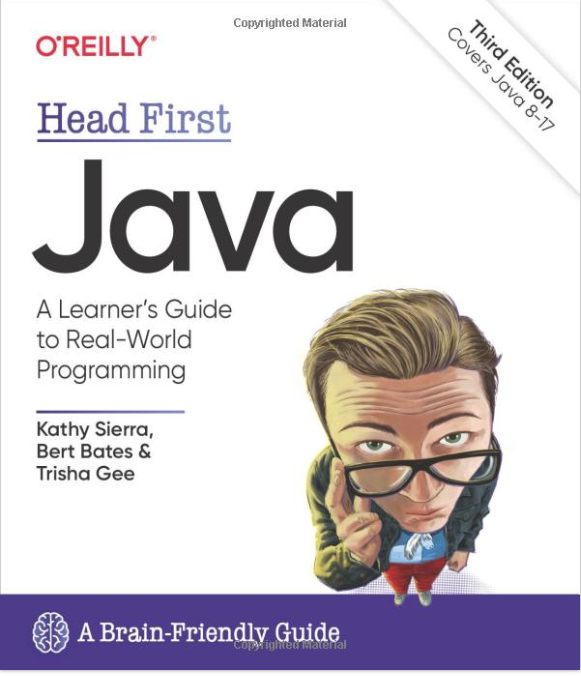
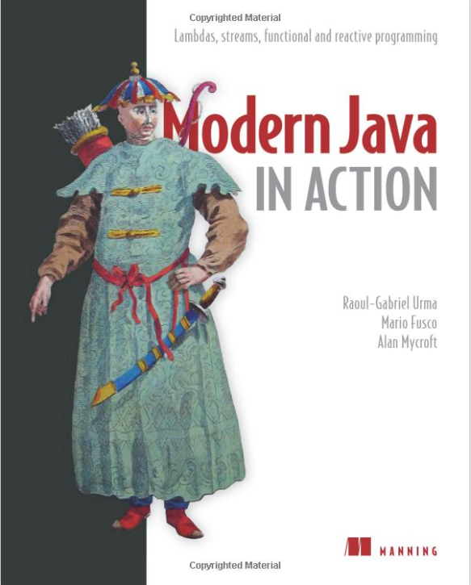
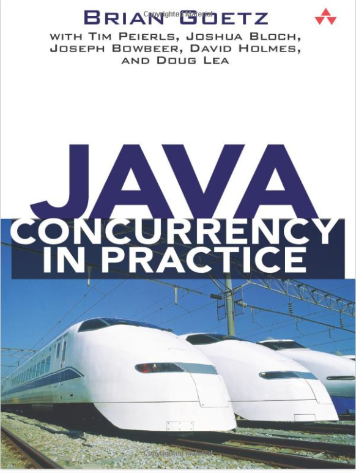
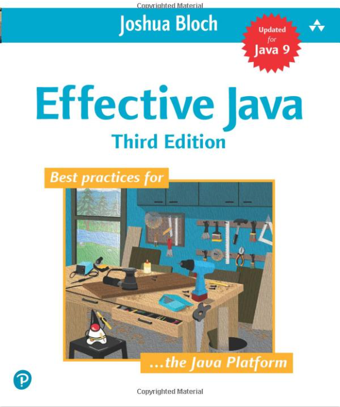
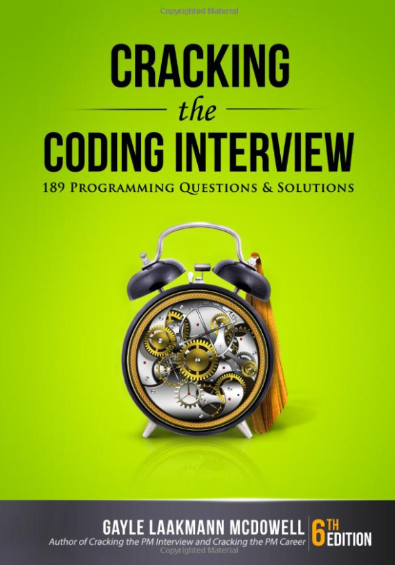

# Guidemy - Third Trials

### What it is like working at the banks

There are 3 types of financial institutions which you will be working in:

- Sell-Side banks (most common): JP Morgan, Morgan Stanley, Goldman Sachs, etc.
- Buy-Side hedge funds: Citadel, Millennium, Optiver, etc.
- Crypto firms: OKX, Crypto.com, BitMEX, etc.

Pure technical firms: MAANG (Meta, Apple, Amazon, Netflix, Google), HK Jockey club, etc.

Most of the team structures will have team of:

- Developers, tech leads, architects
- QA teams
- Business Analysts
- PROD support
- Product Managers or Product Owners
- DevOps teams
- Infra teams

Agile / Scrum is followed which can have sprints of 2-4 weeks.

JIRAs are created and assigned to developers while sprint planning - and then developers have to develop the code
accordingly. Once done the JIRA dev task and unit testing - its released to UAT where QA teams does the testing and
approves if the changes are working or raise bug JIRAs to be fixed by developers. After the QA sign off - release is
done in PROD by support team or devops team on a weekend.

Functionally, developers can land in front office team or middle office / back office teams.

Front office teams are more aggressive and requires NO production issues - so should be very careful about
**resiliency**. Also, it will involve more interactions with business or traders directly especially during the market
hours (trading hours).

Front office developer roles may require building very **low latency** and high performing trading systems and should be
abreast of low latency techniques and design principles.

Middle office or Back office developers work more on booking, reporting, analytics projects where latency may not be
that important.

Technologies mainly used in HK banks:

- Server side: Java (8 or 11 versions), C++, C#, Scala, Kotlin
- Scripting: Python and Bash
- UI: WPF, WinForms, JavaScript, React
- Databases: SQL (Oracle, Sybase, PostGreSQL), NoSQL (MongoDB, Cassandra)
- Data Analytics and Machine Learning: Python, R
- Servers: Linux
- Cloud: AWS, Azure

Almost all the banks are using microservices pattern with cloud integration.

There are 2 career paths for developers:

- Keep on doing hands-on coding and promote to tech lead and architect positions
- Start as a developer, then promote to team lead and project manager (less of hands-on coding and more of people
  management)

The key points to be a highly productive developer here is to have minimum to no bug JIRAs in UAT and no production
issues after the release. Even if you have done 100s of good project deliveries but 1 or 2 production issue can ruin it
all and impact your bonus / ratings!

### The real truth behind the interview process and hiring in banks

Whenever a head count is approved by HR - it comes with a **budget range**. For example, say a senior developer position
is approved and the budget allotted is 800K to 1M HKD per annum.

Now the hiring dev manager take interviews, and she finds 2 good developers suitable. HR will try their best to hire a
candidate with minimum salary (to save money for the bank) and that's when they say that 10%-15% hike from your previous
salary. HR get bonus points for saving the money!

However, if you have done really well in interviews and even if your salary is much lower (say, 400K-500K) -> you can
get the salary of budget allotted, i.e. 800K to 1M HKD per annum. Because hiring dev manager can overrule HR and hire a
candidate as it's still under the allotted budget range.

### How to prepare for interviews

Most of the banks ask questions based on your main programming language (Java or C# or C++) and data structure
algorithms. More tech-savvy banks are also asking system design interview problems.

So, I will suggest to keep aside at-least 3-6 months for interview preparations - take time on early mornings
(before work) or late evenings (after work) and weekends to study and prepare.

### Java: Prepare the real coding interview problems from Java books or online

#### Head First Java

#### Java 8 or Java 11 or Java 17 certifications

#### Modern Java in Action

#### Java Concurrency in Practice

#### Effective Java

### Data Structures and Algorithms

#### Solve top 75 or top 150 problems on **Leetcode**

#### Cracking the Coding Interview

### System Design

There are 2 classic books written by **Alex Xu**

#### System Design Interview – An insider's guide

#### System Design Interview – An Insider's Guide: Volume 2

The key point here is to practice every day and prepare for 1-2 hours. When applying for a job via an agent, check the
job description and brush up the topics to be asked.

### How to find resources

1. **Books**: go an amazon site and search for a topic - say "Clean Code". It will list down all the best books with the
   highest ratings and customer feedbacks. Chose the best book.
2. **Online free videos**: similarly search for the topic on Google -> search for videos -> it will give the highest
   viewed videos.
3. **Paid courses**: various sites are available like **Udemy**, **Coursera**, **edX**, **Lynda**, **Pluralsight**, etc.
4. **Articles**: there are many good articles available like **Baeldung**, **Medium**, **Quora**, **GeeksForGeeks**, **
   Edureka**, etc.

Alternatively, go to **ChatGPT** and search for best resources available for learning a topic. :)

In the real job, almost all the developers use **StackOverflow** a lot.

### How to learn

Personally, I follow **pomodoro technique** for self-study.

The original technique has **six** steps:

1. Decide on the topic to be learned.
2. Set the pomodoro timer (typically for **25 minutes**).
3. Study the topic - book, online course, article, etc.
4. End the study when the timer rings and take a short break (typically 5–10 minutes).
5. If you have finished fewer than **three** pomodoros, go back to Step 2 and repeat until you go through all three
   pomodoros.
6. After **three** pomodoros are done, take the **fourth** pomodoro and then take a long break (typically 20 to 30
   minutes). Once the long break is finished, return to step 2.

Learning programming is like learning car driving or swimming:

- learn the theory first
- then do hands-on coding as much as possible
- test the code
- refactor / improve the code

**Bottom line**: do as much hands-on coding as possible and try to BUILD something.

### How to stay abreast of the latest technology trends

This is a common myth while working in a bank.

To upgrade to a new version of Java or embrace any new technology, say Kotlin - it requires cost or budget approvals.

In the banks, if a project requires efforts without bringing any significant value to the finance or trading is not
worth.

Only once a technology becomes very outdated and almost out of license (for support) - then we need to upgrade to a
newer version. Same goes with using a new technology.

Nevertheless, for personal interest - if one needs to stay abreast with the latest technology trends, we will suggest
joining events and conferences like: **YOW**, **Eventbrite**, **Java Conferences**, **Oracle and IBM conferences**, etc.

Last but not the least, **YouTube** has got everything and anything as the best resort for learning high quality and
free video contents.  
